<!-- You can read this document with 'Open Preview' in VSCode -->

# **Online Adventure Game to Teach Basic Programming Logic and Skills**

**`YIKE2 - HKUST 2023 Final Year Project for COMP 4981/ CPEG 4901`**

# **Background**

This **`block coding game`** is a fyp project for 2023 Final Year Project COMP 4981/ CPEG 4901. We created an educational game to teach player with basic programming logic and skills. We aims to create a accessible web game that even people who are unfamiliar with **`using computer/typing`** can learn from this game.

# **Environment**

This project is developed in [ReactJS framework](https://github.com/facebook/react), using NodeJS in **`version 14`**.

The main libraries that used in the project are:

- [ReactJS](https://github.com/facebook/react)
- [Blockly](https://github.com/google/blockly)
- [Phaser 3](https://github.com/photonstorm/phaser)
- [JS-Interpreter](https://github.com/NeilFraser/JS-Interpreter)
- [Material UI](https://github.com/mui/material-ui)
- [React Router](https://github.com/remix-run/react-router)
- [Axios](https://github.com/axios/axios)

# **Installation**

This project is developed under npm **`version 6.14`**. Install the project with npm

## **Front-end website**

Install all the dependencies under **`/client`** using NPM

```
cd .\client\

npm install
```

## **Local server connected with local database**

Install all the dependencies under **`/server`** using NPM

```
cd .\server\

npm install
```

# **Get Started**

This website is developed and host locally. During the development, we were using **`XAMPP`** to setup our local database.

1.  **Install XAMPP**

    Install **`XAMPP`** from the official Apache Friends website https://www.apachefriends.org/index.html.

2.  **Start Servers**

    Start **`Apache`** and **`MySQL`** servers in the XAMPP Control Panel.

    <div align="center">

    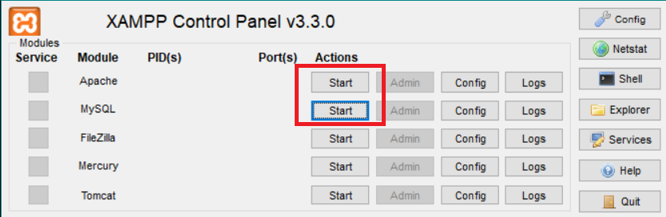

    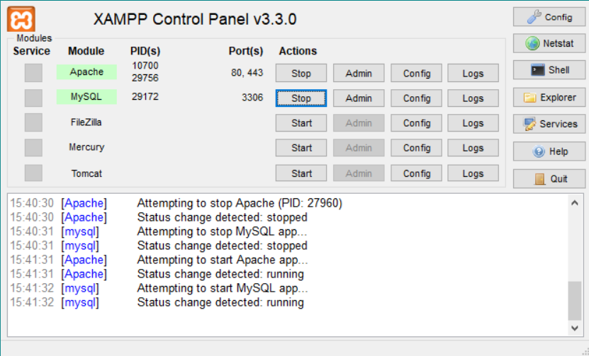

    </div>

3.  **Open phpMyAdmin**

    Access **`phpMyAdmin`** at http://localhost/phpmyadmin/.

4.  **Create New Database**

    Create a new database in **`utf8mb4_unicode_ci`** character encoding, name it **`timetocode`**.

    <div align="center">

    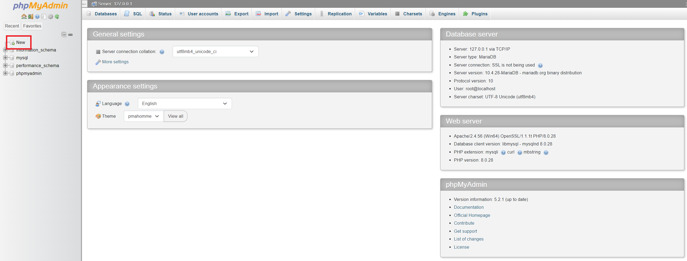

    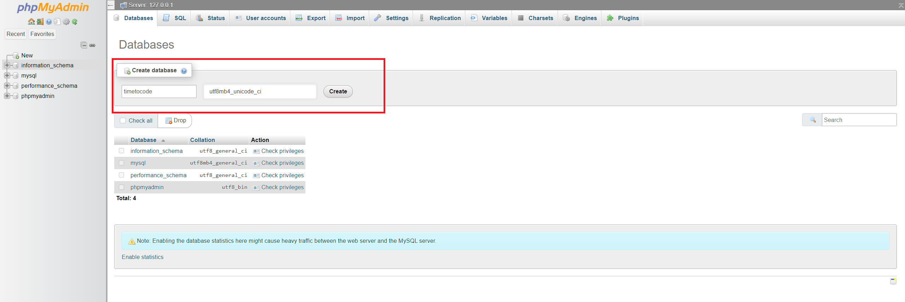

    </div>

5.  **Import Database Schema**

    Click on the new database and then click on the **`Import`** tab. Upload the **`database-schema.sql`** file in **`server\database-schema.sql`**.

    <div align="center">

    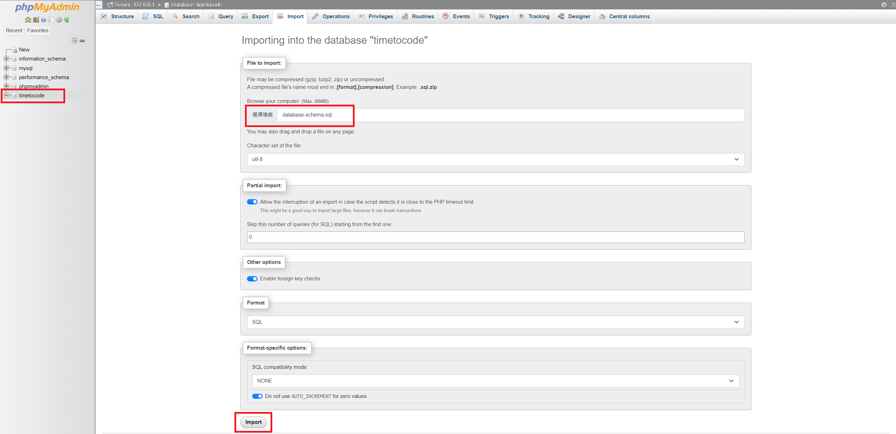

    </div>

    The table should look like **`this`** if the file is imported successfully.

    <div align="center">

    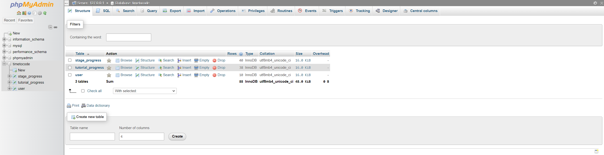

    </div>

    After connected to the **`XAMPP`**, launch the webpage and local server with:

    ```
    cd .\client\

    npm start
    ```

    ```
    cd .\server\

    npm start
    ```

# **Usage**

1. **`Register` an account**

2. **Or `Login` with account: `admin`, password: `admin`**

   <div align="center">

   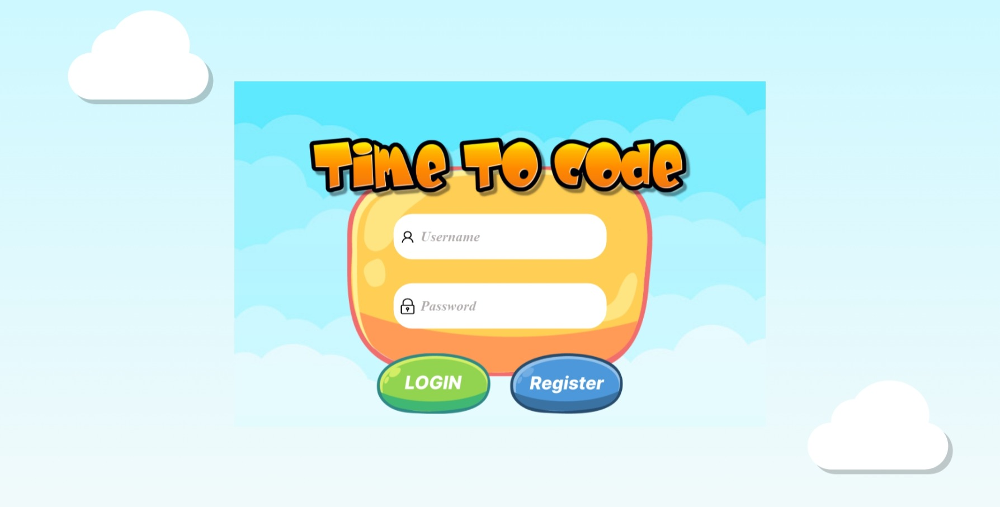

   </div>

3. **If using a `new account`, the content of `stage mode` is not yet unlocked**

    <div align="center">

   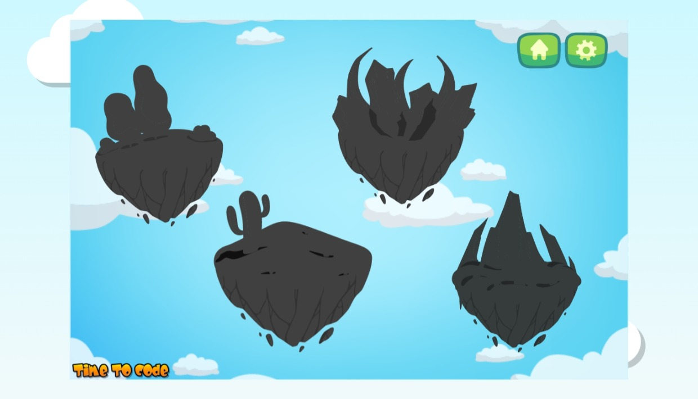

   </div>

4. **Unlock the `stage mode` by going through `tutorial mode` and answering the question correctly**

    <div align="center">

   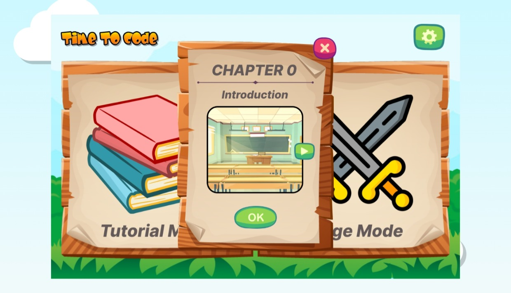

   </div>

5. **Unlock `next level` by solving all the levels you have**

   <div align="center">

   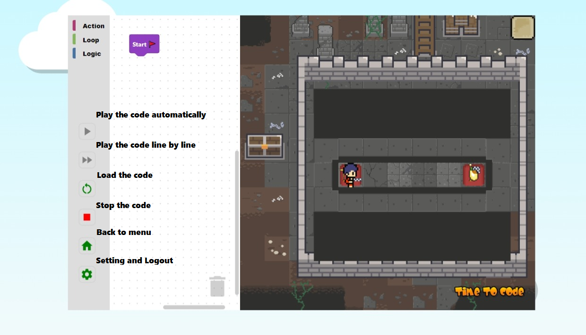

   </div>

6. **If you have no idea for the puzzle, you can look for the answer by pressing the `Hint Buttons`**

   <div align="center">

   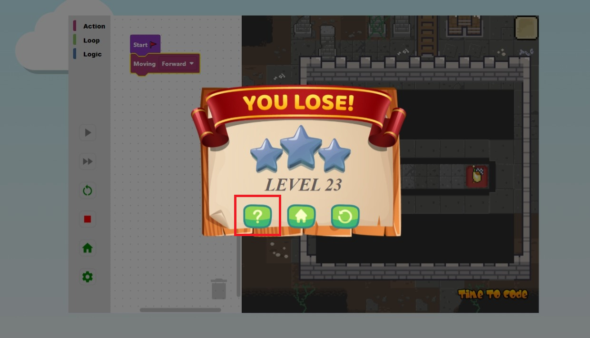

   </div>

# **Copyright and license**

All the audio, image or material used in this project are either **`our own design`**, **`copyright-free`** or permitted for use in **`non-commercial`** projects.

All sprite and tilesets used in project are from [itch.io](https://itch.io/game-assets).
